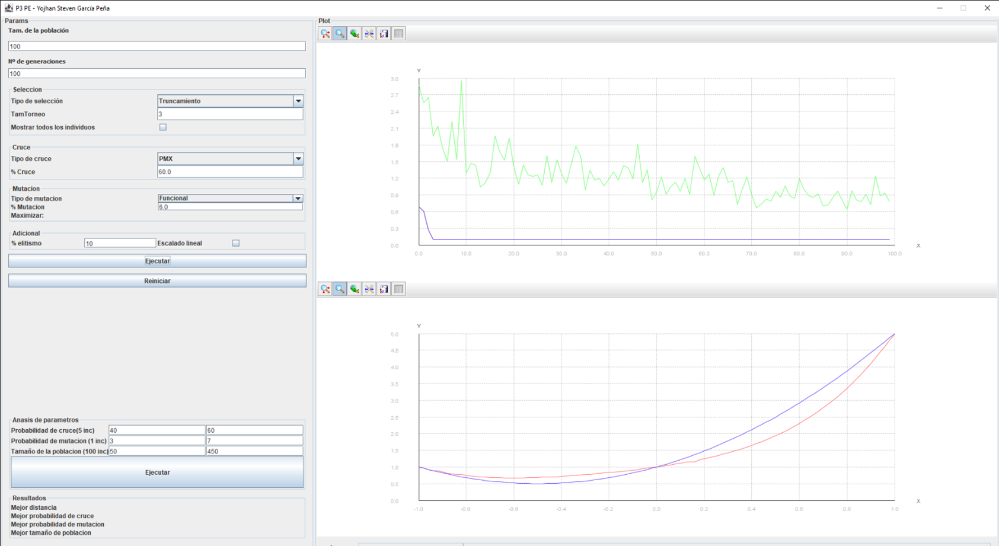

# Evolutionary Algorithm in Java
Academic project focused on the implementation and analysis of a parameterizable evolutionary algorithm. Includes a graphical interface, experimentation features, and a written technical report.

## Goal
This project explores the application of evolutionary algorithms to solve a target-matching problem. The algorithm iteratively improves a population of candidate solutions using biologically inspired operations such as selection, mutation, and recombination. The main objective is to evaluate the effect of parameter tuning on performance and convergence.

## How it Works
The algorithm is based on representing each individual as a character string. Given a target string, the algorithm evolves an initial random population through generations, aiming to produce an exact match.

Users can configure the following:
- **Target string**
- **Population size**
- **Mutation rate**
- **Mutation strategy** (replacement or swap)
- **Selection method** (elitist or probabilistic)
- **Crossover method** (one-point or two-point)

The interface allows users to:
- Launch experiments with custom settings
- Observe real-time updates of best individuals and population metrics
- Monitor convergence behavior and generation count

## Technical Highlights
- Modular Java implementation using standard object-oriented patterns.
- GUI built with Swing for parameter input and result display.
- Fitness function defined as the number of matching characters with the target string.
- Two mutation operators: character replacement and position swapping.
- Selection based on either top-performers or probabilistic selection proportional to fitness.
- Recombination via one-point or two-point crossover.

## Results Summary
The project includes an in-depth analysis of how different parameter combinations affect convergence speed and final accuracy. Key findings include:
- Higher mutation rates can speed up exploration but may slow down convergence after early improvements.
- Elitist selection tends to converge faster but risks premature stagnation.
- Two-point crossover produces slightly better convergence than one-point in complex targets.

Detailed experimental results, tables, and conclusions can be found in the reports.

## Technologies Used
- Java  
- Swing (Java GUI toolkit)  
- Eclipse (project structure and build)

## Documentation
The `reports/` folder contains:
- Final technical report (PDF)
- Summary document with key tables and analysis

## Author
Yojhan Steven García Peña  
[GitHub](https://github.com/sryojhan)  
[LinkedIn](https://www.linkedin.com/in/yojhan/)
